This tutorial assumes you have already
- Read the [Pre-requisites](/tutorials/Pre-requisites)
- Downloaded the latest Forge MDK
- Setup your mod folder as described at the top of [the main Forge 1.14.4 tutorials page](/tutorials/1.14.4/forge/)
- Read and followed [1.0 - Gradle Configuration](/tutorials/1.14.4/forge/1.0-gradle-configuration/)

# Eclipse
1) Import as gradle project  
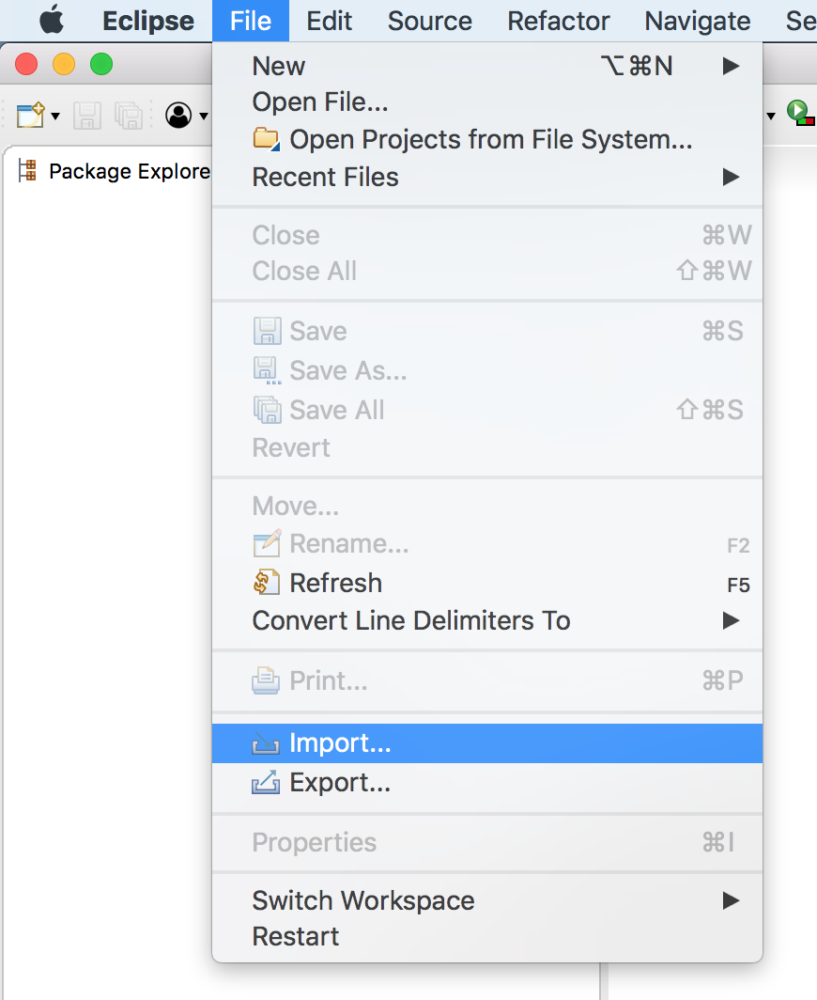  
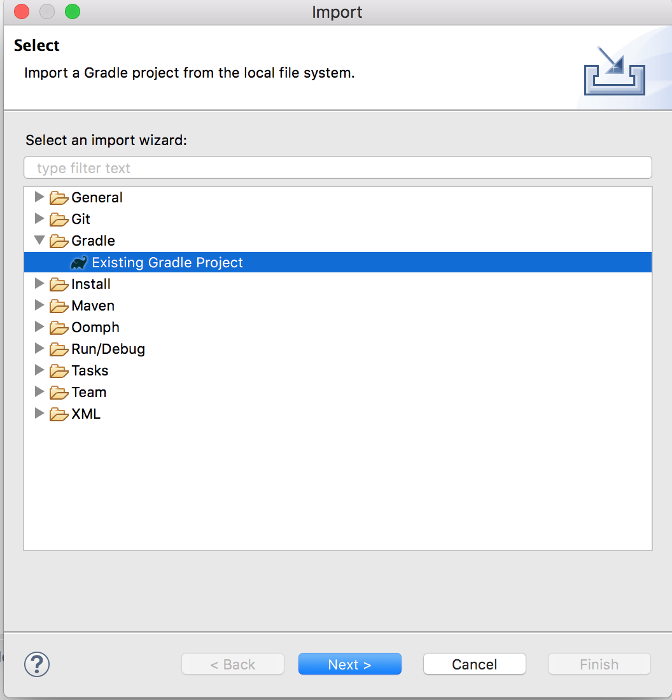  
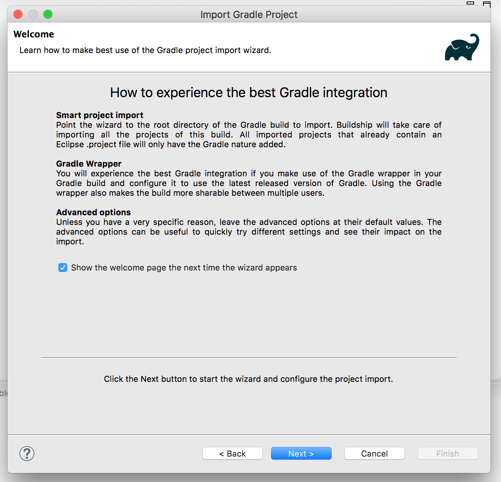  
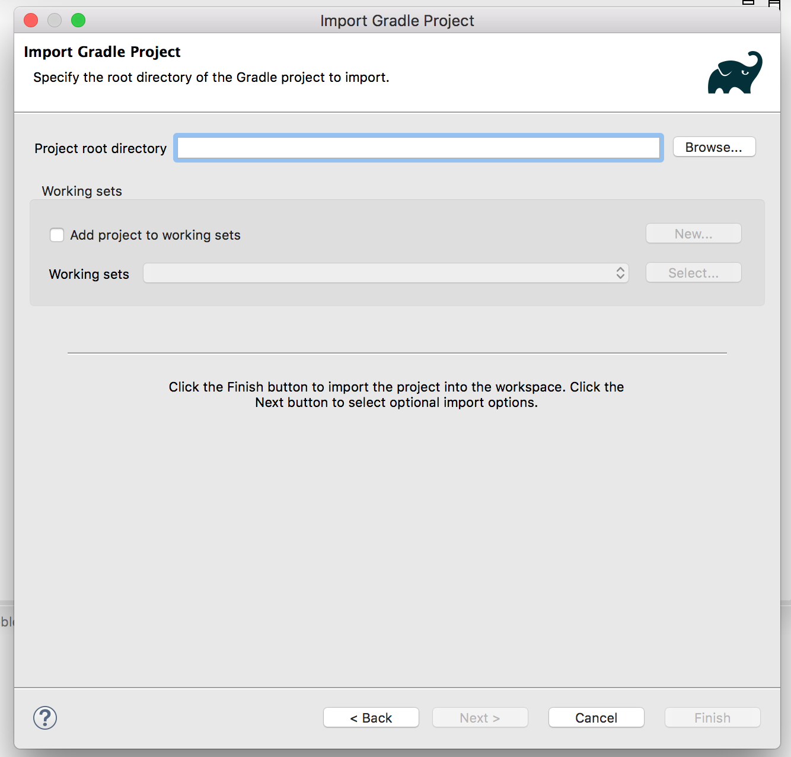  
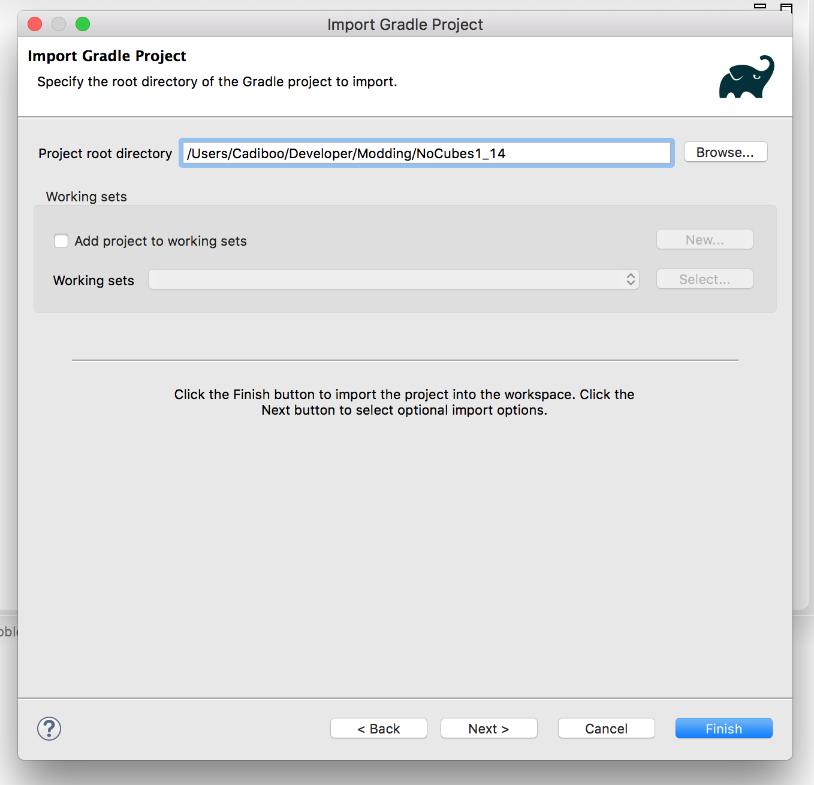  
2) Wait for import/sync to complete  
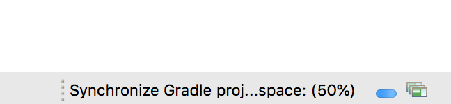  
  
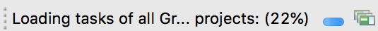  
3) Go to Gradle Tasks  
  
4) Run `eclipse` task  
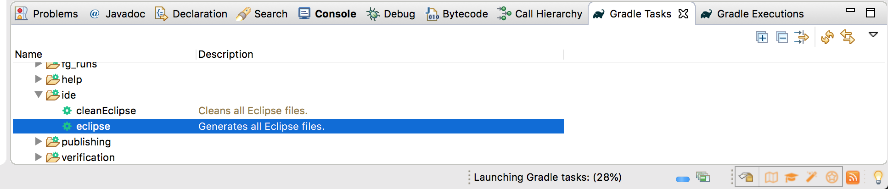  
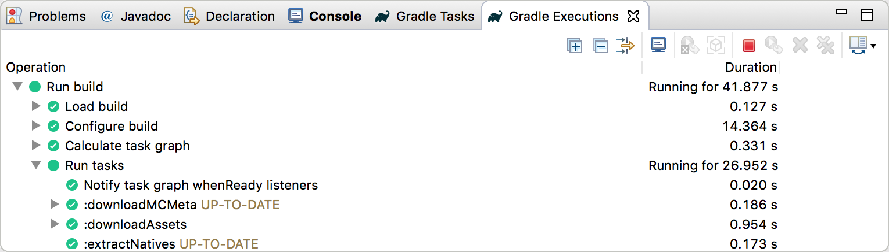  
5) Run `genEclipseRuns` task  
  
  
6) Choose run configuration  
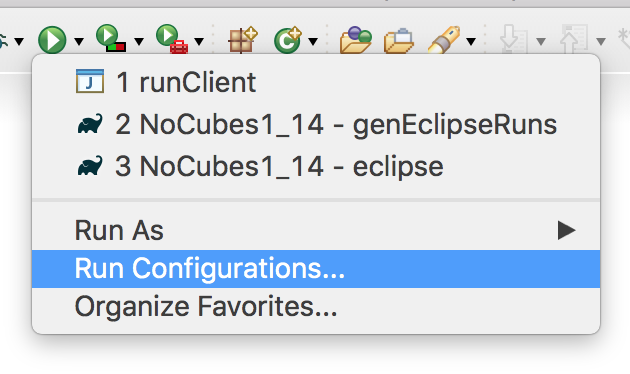  
  
7) Run  
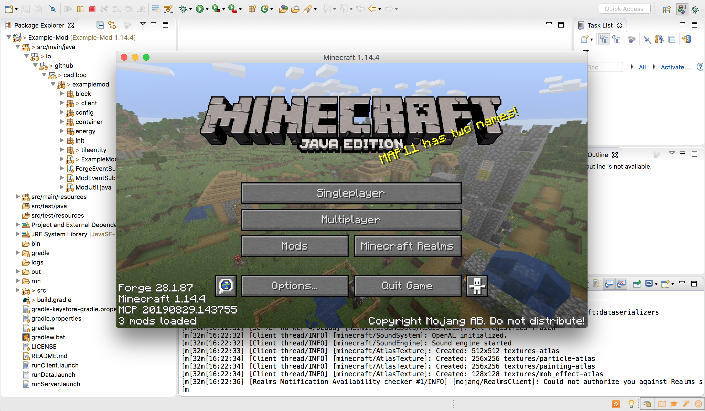  

##### [1.2 - Basic Mod](../1.2-basic-mod)
