This tutorial assumes you have already
- Read the [Pre-requisites](/tutorials/Pre-requisites)
- Downloaded the latest Forge MDK
- Setup your mod folder as described at the top of [the main Forge 1.14.4 tutorials page](/tutorials/1.14.4/forge/)
- Read and followed [1.0 - Gradle Configuration](../../1.0-gradle-configuration/)
- Chosen IntelliJ from [1.1 - Importing the project into your IDE](..)

# IntelliJ
1. Open build.gradle as a Project by going to `Menu > Import > build.gradle` or `File > Open > build.gradle > Open as Project` to switch if you are already working on another project  
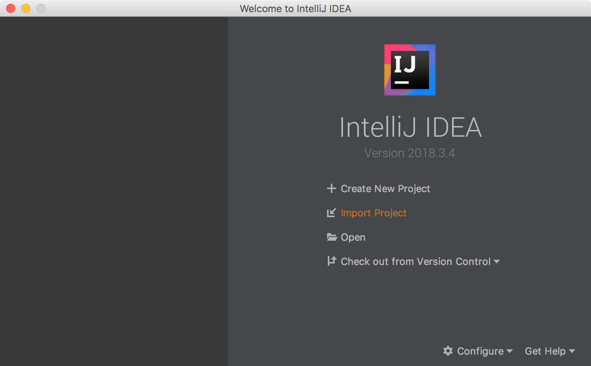  
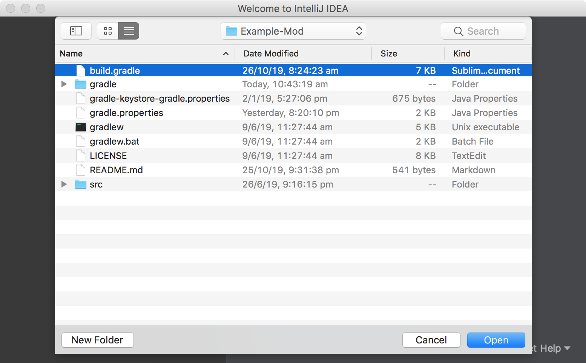  
2. Use default settings  
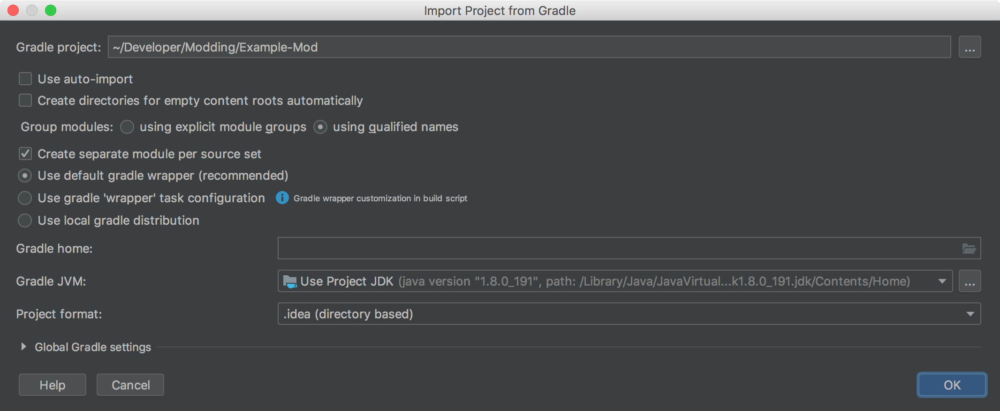  
Personally I uncheck `Create separate module per source set`  
  
3. Wait for build sync to download everything and finish  
This will take a while as Forge downloads everything and sets up your modding environment.  
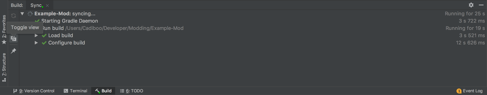  
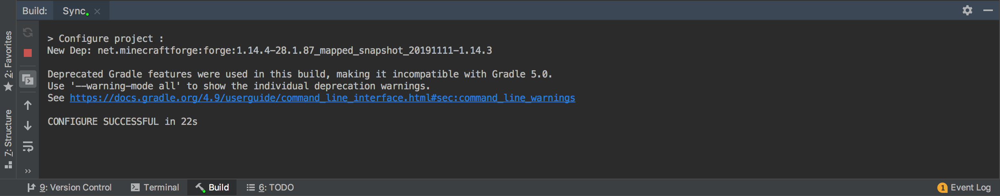  
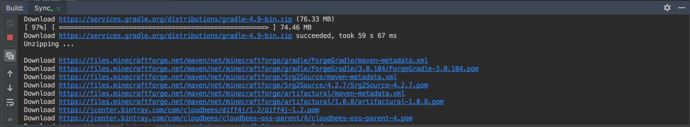  
4. Refresh gradle project  
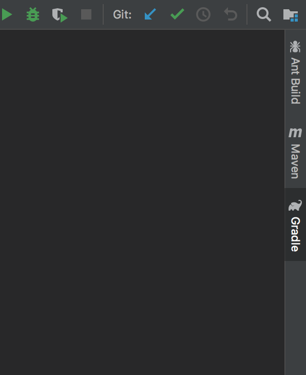  
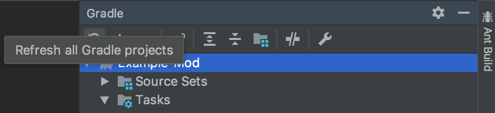  
5. Run the task `genIntellijRuns` to generate the run configs to run minecraft  
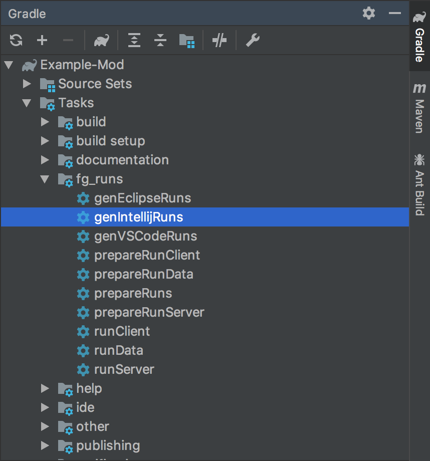  
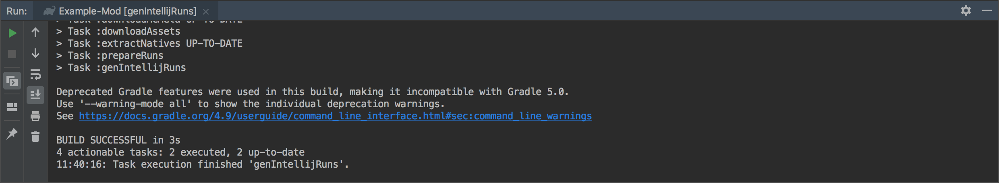  
6. Go to the Run Configurations menu and fix (set the module of) your `runClient` run configuration  
  
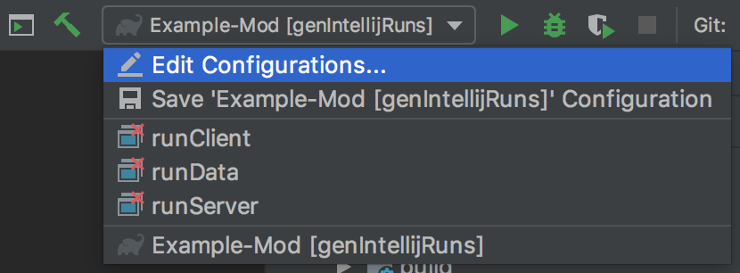  
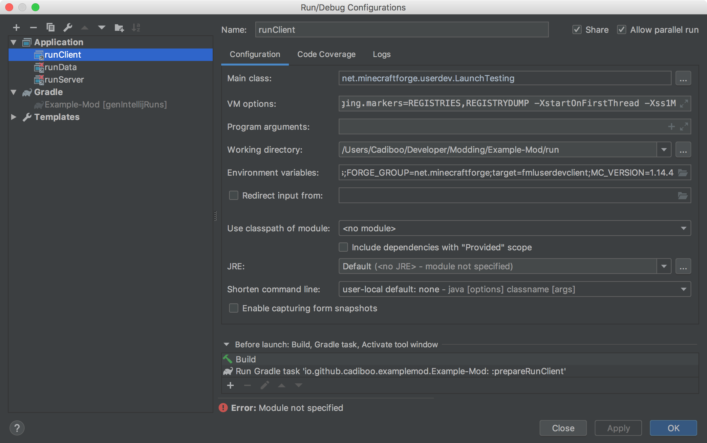  
  
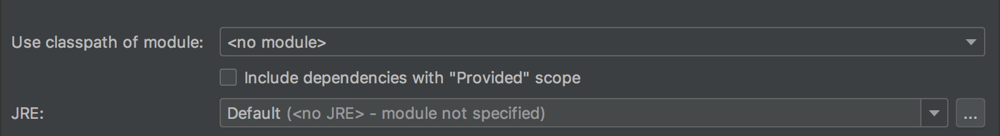  
  
Save your changes  
All of these run configs launch minecraft.  
  
	- `runClient` launches the minecraft client
	- `runData` launches minecraft in a special mode that only does the bare minimum required to automatically generate json files like recipes and blockstates.
	- `runServer` launches the minecraft server
7. Run the game  
  
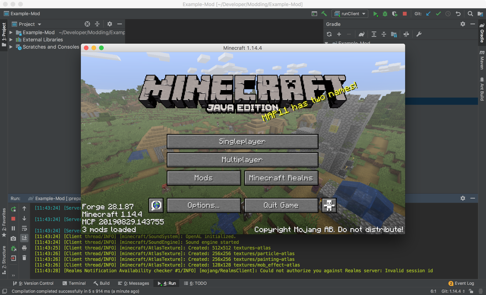  

# Troubleshooting
When asking for help make sure to include your console log.  
  

##### [1.2 - Basic Mod](../../1.2-basic-mod)
