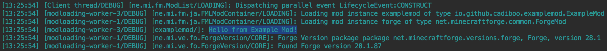

This tutorial assumes you have already
- Read the [Pre-requisites](/tutorials/Pre-requisites)
- Downloaded the latest Forge MDK
- Setup your mod folder as described at the top of [the main Forge 1.14.4 tutorials page](/tutorials/1.14.4/forge/)
- Read and followed [1.0 - Gradle Configuration](/tutorials/1.14.4/forge/1.0-gradle-configuration/)
- Read and followed [1.1 - Importing the project into your IDE](/tutorials/1.14.4/forge/1.1-importing-project/)
- Read and followed [1.2 - Basic Mod](/tutorials/1.14.4/forge/1.2-basic-mod/)

Our mod currently doesn't do anything. Lets change that and print something to the log!  

To start off, make a `public` constructor with no arguments/parameters with nothing in it
> Access levels  
> Access level modifiers determine whether other classes can reference a particular class, use a particular field, or invoke a particular method. Having our constructor be `public` allows Forge to call it and create our mod.
> - `public` Can be accessed by any class
> - `protected` Can only be accessed by its own class or subclasses
> - *package-private* (no explicit modifier) Can only be accessed by classes in the same package
> - `private` Can only be accessed in its own class
>
> [More info](https://docs.oracle.com/javase/tutorial/java/javaOO/accesscontrol.html)

> Constructors  
> A class contains constructors that are invoked to create objects from the class blueprint. Constructor declarations look like method declarations—except that they use the name of the class and have no return type.  
> [More info](https://docs.oracle.com/javase/tutorial/java/javaOO/constructors.html)

Now make a constant logger for your mod  
`public static final Logger LOGGER = LogManager.getLogger(MODID);` (import the `log4j` logger not the `java.util` one)  
Then in your constructor call `LOGGER.debug("Hello from YourModName!");`  
For eclipse people, you'll need to refresh `/src/`  
Now run your game again and you should be able to see "Hello from YourModName!" in your log  

Your final code should look something like
```java
package io.github.cadiboo.examplemod;

import net.minecraftforge.fml.common.Mod;
import org.apache.logging.log4j.LogManager;
import org.apache.logging.log4j.Logger;

@Mod(ExampleMod.MODID)
public final class ExampleMod {

	public static final String MODID = "examplemod";

	public static final Logger LOGGER = LogManager.getLogger(MODID);

	public ExampleMod() {
		LOGGER.debug("Hello from Example Mod!");
	}

}
```


##### [1.4 - Proxies](../1.4-proxies)
